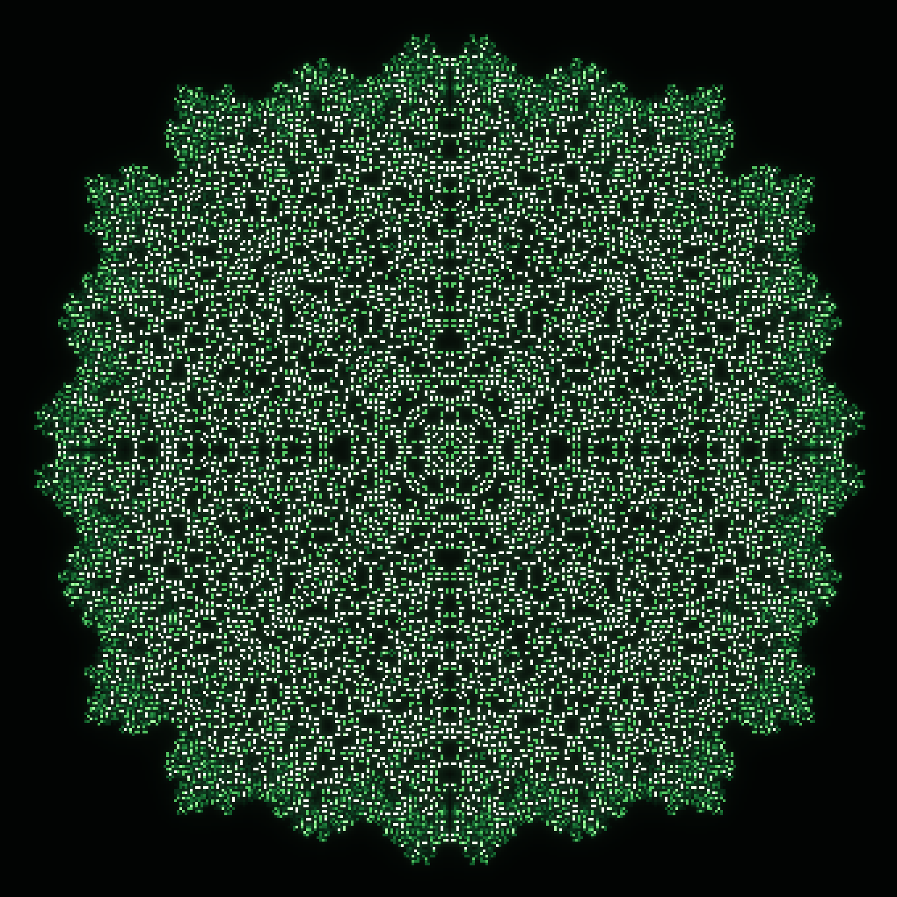
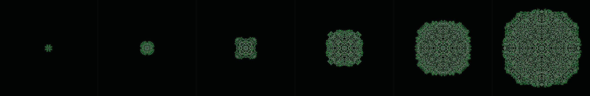
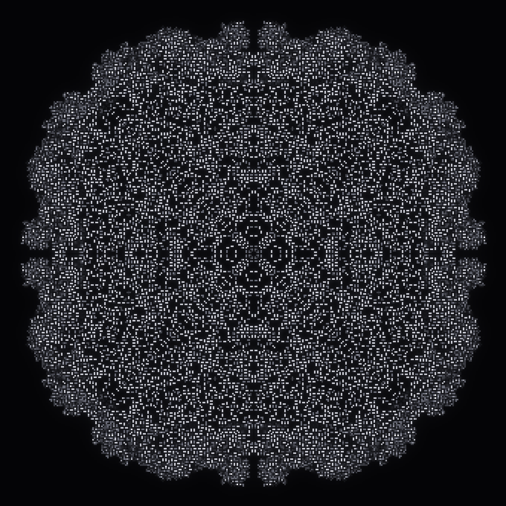
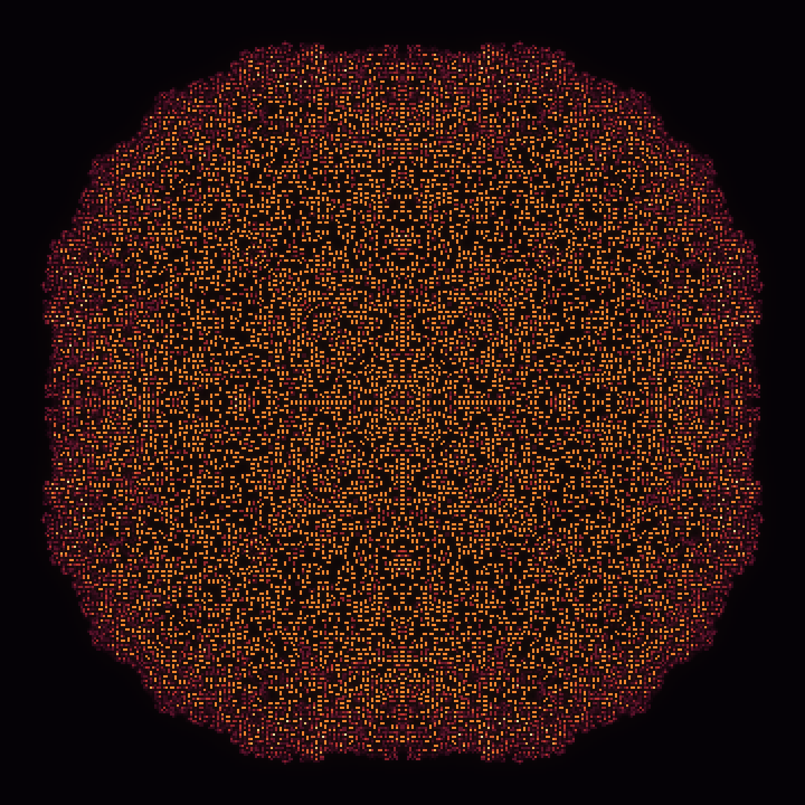
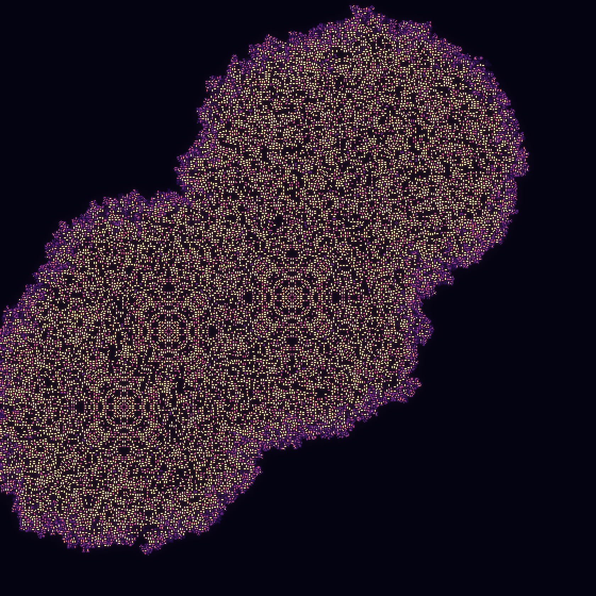
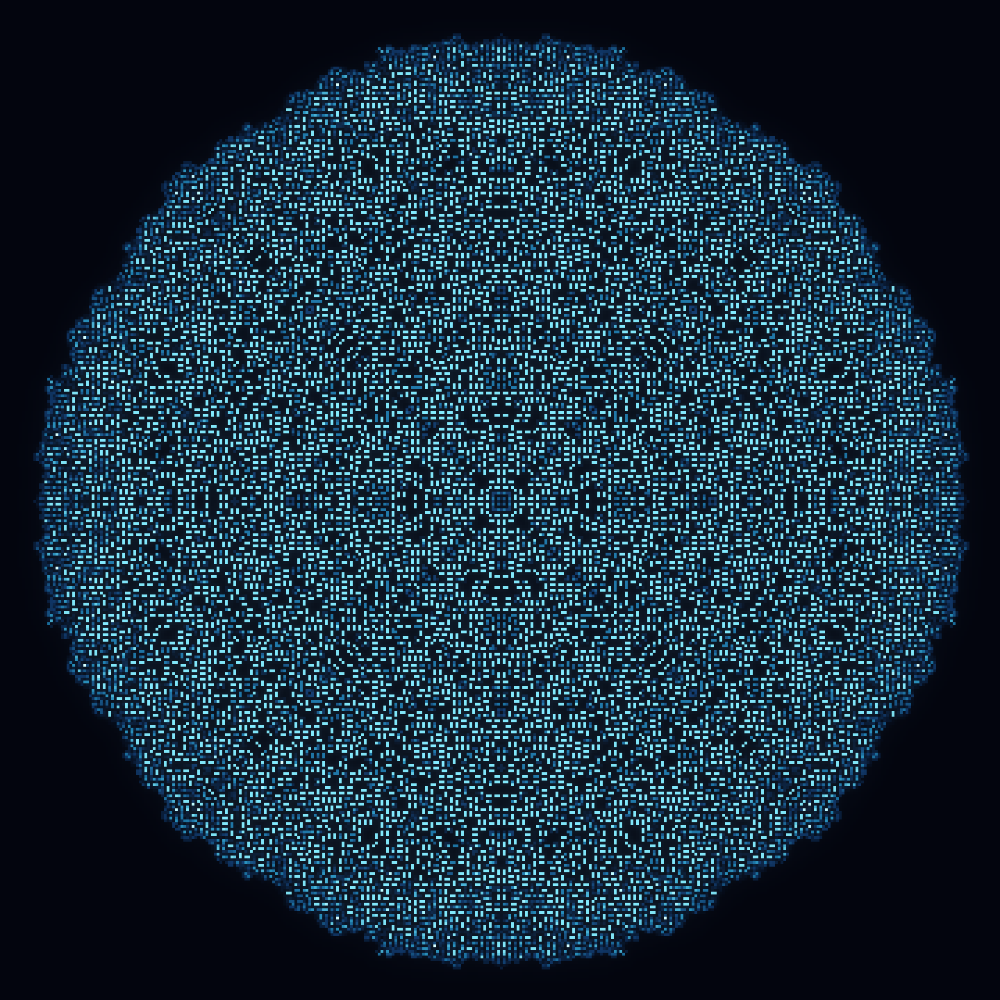
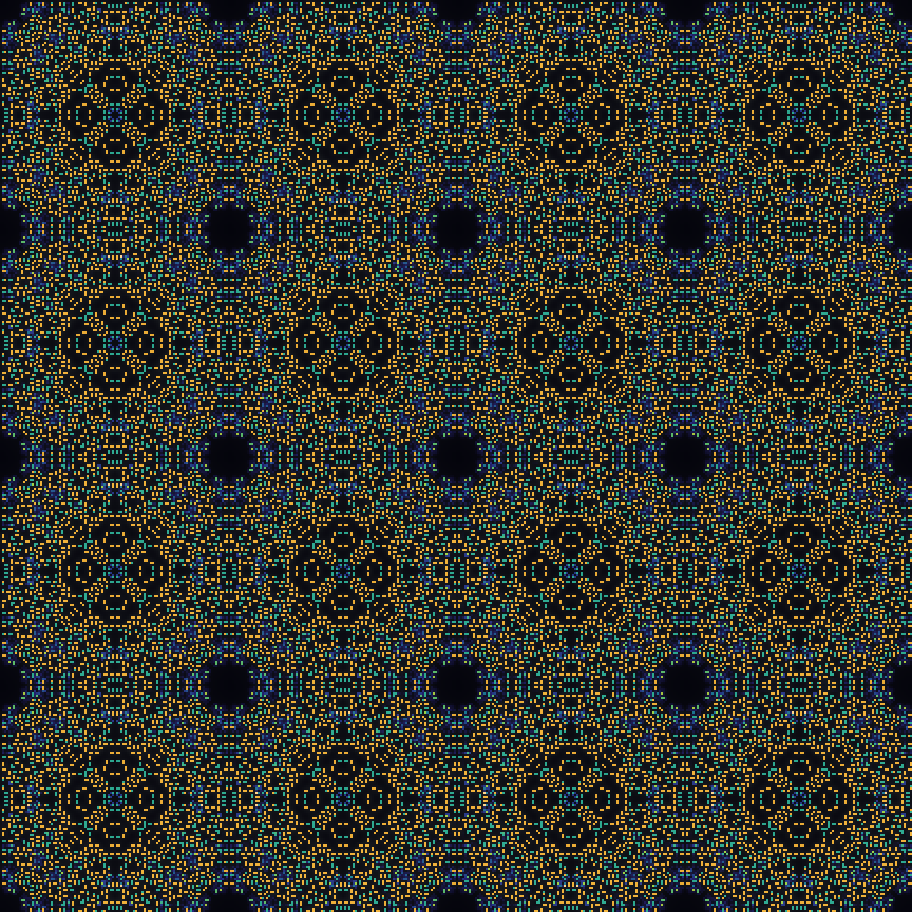
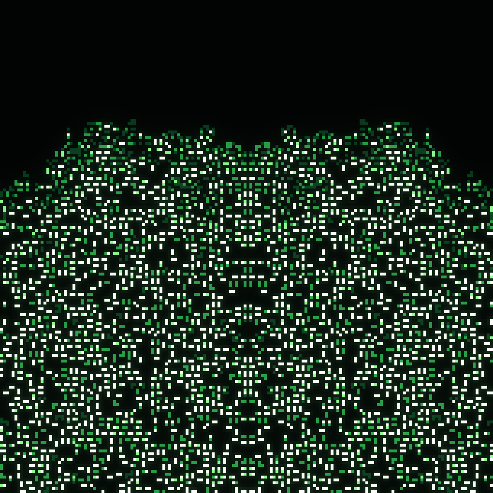
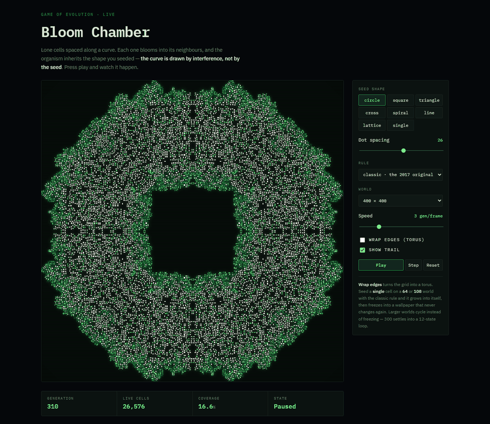
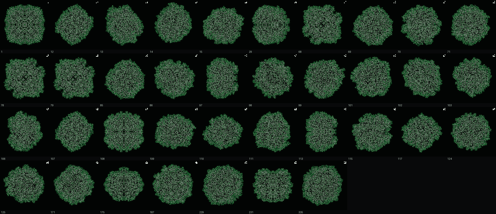

# Game of Evolution

Conway's Game of Life, but a cell holds a **level** instead of a bit.

Its influence on its neighbours scales with that level, and the neighbourhood
pushes it up and down a ladder instead of flipping it on and off. That one
change is enough: from a **single cell** on an empty grid the rule grows an
eight-fold mandala that never stops expanding.

<p align="center">
  
</p>

The rule is the one from my 2017 Java build ([reivash/GOE](https://github.com/reivash/GOE)).
This is a rewrite with a hand-written CUDA kernel behind it, running at
**~317 Gcell/s** on an RTX 4080 SUPER — about 86% of the card's memory
bandwidth — and a renderer built to make the patterns worth photographing.

---

## The rule

A cell's level lives in `0..limit`. The neighbourhood factor `N` is the **sum**
of the eight neighbours' levels — not a population count — so a level-4 cell
pushes on its neighbours four times as hard as a level-1 cell does. `N` then
selects a delta, and the result is clamped back onto the ladder:

| `N` | effect | |
|---|---|---|
| `N < starve` | `level − 1` | starvation |
| `starve ≤ N < grow` | `level` | equilibrium |
| `grow ≤ N < crowd` | `level + 1` | growth |
| `N ≥ crowd` | `level − slope·(N − crowd)` | overcrowding, increasingly punishing |

The original's thresholds are `limit=4, starve=2, grow=3, crowd=4, slope=1`,
which is the `classic` preset.

### Why the seed has to be a level-3 cell

This is the part that surprised me when I rebuilt it. A lone cell at level `L`
presents each of its eight neighbours with a neighbourhood factor of exactly
`L`. So those neighbours are born only if `L` lands in the growth band,
`grow ≤ L < crowd`. Seed below it and the pattern starves on the very first
generation; seed above it and overcrowding kills it just as fast. For the
classic rule the growth band is `[3, 4)` — a single integer wide. **3 is the
only level that blooms**, which is why it was the magic number in 2017.

Seeds with adjacent cells shift the arithmetic: in a ring, each cell already
has two neighbours contributing, so the level has to come *down* to compensate.
`Automaton.from_seed` defaults to `rule.grow`, and `run_to_extent` raises with
an explanation when a seed dies on contact.

### Growth

<p align="center">
  
</p>

Generations 60 → 860 of the same bloom. The radius grows roughly linearly at
about a fifth of a cell per generation, and the interior keeps reorganising
long after the front has moved on.

---

## The gallery

Rendered by `python -m goe gallery`. Every image below comes from one command
and a seed of at most a few dozen cells.

| | |
|---|---|
|  |  |
| **genesis** — the original rule from a single cell at level 3. The eight-fold symmetry, the concentric rings and the scalloped rim are the grid's own symmetry made visible; nothing in the seed asked for any of it. | **deep-rings** — the same thresholds on a six-level ladder. The extra headroom lets the interior thin out into standing rings instead of saturating. |
|  |  |
| **mandala** — a random blob folded into eight-fold symmetry before it is planted. The randomness picks the motif; the rule keeps it symmetric forever. | **collision** — five lone cells, far apart. Each blooms on its own until the fronts meet, and the interference breaks the symmetry into something no single seed would produce. |
|  |  |
| **veil** — a ring, not a point. Growth needs heavy support here and crowding bites twice as hard, so both fronts stay thin and meet at the centre. | **weave** — a lattice of single cells on a torus. Every bloom grows into its neighbours at once, and the interference tiles the whole plane. |

<p align="center">
  
</p>

**filigree** — the growth front at seven times magnification, with the echo
turned off so nothing but the levels themselves is drawn. The lace is not a
texture; it is individual cells.

---

## Watch it grow

The stills above are end states. **[`viewer/index.html`](viewer/index.html)** is
the same automaton running live in the browser — open the file directly, no
build step, no server, no dependencies. It reimplements the rule in JavaScript
with the same row-triple decomposition the CUDA kernel uses, and it is verified
against the Python: identical live-cell counts at every generation checked.

<p align="center">
  
</p>

Pick a seed shape, set the dot spacing, press play. Eight shapes, all six rules,
speed up to ten generations a frame, and a readout of generation, live cells,
coverage and state.

A run is linkable — the query string sets everything, and `gens` runs a fixed
number of generations and stops, which is how both stills on this page were
captured:

```
viewer/index.html?shape=square&spacing=26&rule=classic&world=400&gens=290
```

Two things worth trying. **Drop the spacing below about ten** and the seeds kill
each other outright — the readout flips to *Extinct* within a few generations,
which is the overcrowding constraint made visible. And **tick "Wrap edges" with
the `single` seed on a 64 or 108 world**:

<p align="center">
  
</p>

One cell grows into itself, and at generation 236 it stops changing — for good.
The viewer detects that exactly (a generation in which no cell changes is a
fixed point) and reports *Frozen at 236*. Larger worlds cycle rather than
freeze: a 300-wide torus settles into a twelve-state loop instead.

---

## Numbering the seeds

Wolfram's rule number is a 1-D rule's truth table read as a base-2 numeral.
The same trick numbers *seeds* here. Fix a `size × size` patch and an alphabet
of the levels a cell may take, and a seed is a base-`B` numeral whose digits
are the patch read top-left to bottom-right — so written out in base `B`, **the
code is a picture of the seed**:

```python
>>> decode(625, size=3, alphabet=(0, 1, 2, 3, 4))   # 625 == 1 * 5**4
array([[0, 0, 0],
       [0, 1, 0],          # 625 in base 5 is 000010000
       [0, 0, 0]], dtype=int8)
```

`code 0` is the empty patch — nothing. With the binary alphabet `(0, 3)` on a
3×3 patch there are `2⁹ = 512` codes; with every level in play, `4⁹ = 262,144`.

### Most of those codes are the same organism

The rule is isotropic and the grid is homogeneous, so a seed that differs only
by *where it sits*, or by a rotation or a flip, grows the identical bloom. A
single cell in the top-left of the patch and a single cell in the middle are
the same seed. `canonical_key` folds each orbit — 8 dihedral symmetries × every
translation — to one representative, and the redundancy is enormous:

| patch | alphabet | raw codes | distinct organisms |
|---|---|---|---|
| 3×3 | `(0, 3)` | 512 | **86** |
| 3×3 | `(0,1,2,3)` | 262,144 | 1,021 in the first 3,000 codes |

86 is small enough to simply run all of them:

```bash
python -m goe seeds --rule classic --size 3 -o screenshots/seed-atlas.png
```

```
86 distinct up to symmetry and translation: 37 bloom, 16 static, 32 extinct, 1 empty
```

<p align="center">
  
</p>

All 37 that bloom, labelled by code, each with a thumbnail of its own seed in
the corner. They are not as different as you might hope, and that is the
finding: **the seed fixes the symmetry class and the interior detail, but not
the asymptotic shape.** Code 1 (one cell) keeps full eight-fold symmetry
forever; code 108 has a single mirror axis; code 15 is four-fold. All of them
converge on the same expanding disc, because the growth front's speed is a
property of the rule, not of what started it.

The other 49 are worth knowing about too: 32 die outright and 16 freeze into
still lifes. A seed *dying* is the common case, for the growth-band reason
above — pack cells together and they overcrowd each other on the first step.

Any code can be used directly as a seed:

```bash
python -m goe render --seed code --seed-arg code=108 --seed-arg size=3 -o s108.png
```

Add `--full` to the survey to enumerate seeds where cells take intermediate
levels rather than just dead-or-alive, and `--max-codes` to bound the walk.

---

## Finding the rules

`classic` is the reference, but the threshold family has room in it, so I swept
it rather than guessed. The trap is that most live rules settle into a uniform
noise disc — high activity, nothing to look at. Scoring by *churn* selects
exactly those. What reads as beautiful is density that varies **across scales**:
rings, filaments, voids.

So each candidate is scored by the coefficient of variation of its cell density
at two block sizes, inside the occupied region only. That leaves a few hundred
survivors out of a few thousand rules, and `PRESETS` is the top of the ranking.

The classic 2017 thresholds place **7th of 575**, which is a reassuring result
for a rule I picked by hand at 22. The rule that placed *first* is the classic
thresholds on a longer ladder — the same structure, with somewhere for the
shading to go. It is the `deep` preset.

| preset | limit | starve | grow | crowd | slope | character |
|---|---|---|---|---|---|---|
| `classic` | 4 | 2 | 3 | 4 | 1 | the original |
| `deep` | 6 | 2 | 3 | 4 | 1 | classic structure, six levels of shading |
| `lace` | 10 | 3 | 4 | 6 | 1 | a looser, lacier weave that spreads faster |
| `veil` | 12 | 3 | 5 | 8 | 2 | slow, finely graded, thin front |
| `flood` | 6 | 2 | 4 | 6 | 1 | fills its disc rather than filigreeing it |
| `filament` | 5 | 1 | 3 | 4 | 1 | thin filaments survive in the wake |

---

## Performance

The rule is one table lookup per cell, so the kernel is bound by memory traffic
and the only question is how few times each cell gets read.

A naive nine-point stencil reads every cell nine times. The usual fix is a
shared-memory halo tile. The faster one, and what ships here, is a **register
sliding window**: the neighbourhood factor decomposes into row triples, and
writing `T(r) = s[r][x-1] + s[r][x] + s[r][x+1]` gives

```
N(y, x) = T(y-1) + T(y) + T(y+1) - s[y][x]
```

so a thread walking *down* a column keeps three triples in registers and
computes one new triple per output row. Each thread owns a strip of 16 rows,
which amortises the start-up cost over the strip: **three global loads per cell
instead of nine**, all coalesced. That is 2.7× the shared-memory tiling version
I wrote first.

`step(n)` also launches all `n` kernels back to back on one stream, swapping the
two device buffers between launches, so a thousand-generation run costs exactly
one host transfer — the one you ask for.

RTX 4080 SUPER, 300 generations, `python -m goe bench`:

| grid | backend | ms/gen | Gcell/s | effective GB/s | vs NumPy |
|---|---|---|---|---|---|
| 512² | NumPy | 1.329 | 0.20 | 0.4 | — |
| 512² | **CUDA** | 0.010 | 25.4 | 50.7 | 129× |
| 1024² | NumPy | 8.272 | 0.13 | 0.3 | — |
| 1024² | **CUDA** | 0.019 | 54.2 | 108.3 | 427× |
| 2048² | NumPy | 47.262 | 0.09 | 0.2 | — |
| 2048² | **CUDA** | 0.016 | 267.2 | 534.4 | 3011× |
| 4096² | **CUDA** | 0.053 | 317.0 | 633.9 | — |

Read those with the caveats they deserve. The GPU column is measured with CUDA
events, not wall clock, and excludes the device→host copy. Grids at or below
1024² are launch-latency bound — 10–19 µs per generation is the floor, not the
kernel. The NumPy column is the readable reference implementation, single
threaded and allocating per step; it is a fair baseline for *this* automaton,
not a tuned CPU ceiling, so the 3011× says as much about NumPy thrashing 4 MB
grids as it does about the kernel. The honest headline is the bandwidth column:
**634 GB/s of an ~736 GB/s card, at 86% of peak.**

The kernel is verified against the NumPy backend by exact integer equality —
every preset, both boundary modes, on a deliberately non-block-aligned
137×251 grid, plus a 300-generation batched run.

---

## Usage

```bash
pip install -r requirements.txt
pip install "cupy-cuda12x[ctk]"    # optional; NumPy backend works without it
```

The CUDA backend needs an NVIDIA driver but **no CUDA Toolkit** — CuPy compiles
the kernel at runtime with the NVRTC it bundles. Without a GPU everything still
runs on NumPy; `--backend` picks explicitly, and `auto` prefers CUDA.

```bash
python -m goe list                 # rules, seeds, palettes
python -m goe gallery -o screenshots
python -m goe seeds -o atlas.png   # exhaustive seed-code survey
python -m goe bench
```

Or just open [`viewer/index.html`](viewer/index.html) in a browser — the live
version needs nothing installed at all.

```bash
python -m goe render --rule deep --seed mandala --seed-arg size=28 --seed-arg seed=5 --palette ember --size 720x720 --scale 2 -g 700 -o bloom.png
```

`--capture` is repeatable and writes intermediate generations alongside the
final frame, which is how the timelapse strip is made.

As a library:

```python
from goe import Automaton, PALETTES, colorize, save

a = Automaton.from_seed((340, 340), rule="classic", seed="single", echo_decay=0.94)
a.run_to_extent(0.92)              # grow until it fills the frame
save(colorize(a.snapshot(), a.rule.limit, PALETTES["phosphor"], echo=a.echo()),
     "bloom.png", scale=4)
```

### Rendering

Two things do most of the visual work beyond the level→colour ramp.

**Echo.** The growth front is thin, and everything interesting about a pattern
is *where the front has been*. The echo buffer keeps a decaying maximum of past
energy, so the structure a bloom carved out stays faintly visible behind the
live cells. It lives on the same device as the grid, so enabling it costs no
extra host transfers. `--echo 0` turns it off, which is what `filigree` does.

**Bloom.** Bright cells bleed light at two scales, a tight core and a wide halo
blurred at quarter resolution. It is what makes a lattice of single pixels read
as something emitting light rather than a noisy bitmap.

Framing matters more than either. A bloom is a speck for its first hundred
generations and overruns the grid a few hundred later, and the window in
between — the whole organism visible, individual cells still resolvable — is
narrow. `run_to_extent` grows until the pattern spans a given fraction of the
grid, so shots are specified as *cells × magnification* and the generation
count takes care of itself.

## Tests

```bash
python -m pytest tests -q
```

CUDA tests skip themselves when no device is present.

## Layout

```
goe/
  rules.py          the rule family and the delta table
  automaton.py      simulation front end, echo buffer, run_to_extent
  backends/
    cpu.py          NumPy reference implementation
    cuda.py         the CUDA kernel and its RawKernel wrapper
  seeds.py          seed patterns
  palettes.py       colour ramps
  render.py         echo, bloom, magnification
  seedcode.py       numbering every seed, and folding symmetry orbits
  atlas.py          exhaustive survey of the seed-code space
  gallery.py        the curated screenshot set
  cli.py            python -m goe
viewer/
  index.html        the live browser viewer, dependency-free
```
